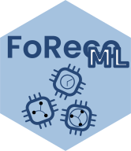

<!-- README.md is generated from README.Rmd. Please edit that file -->

# FoRecoML 

<!-- badges: start -->

[](https://github.com/danigiro/FoRecoML/actions/workflows/R-CMD-check.yaml)
[](https://CRAN.R-project.org/package=FoRecoML)
[](https://github.com/danigiro/FoRecoML)
[](https://cran.r-project.org/web/licenses/GPL-3)
<!-- badges: end -->

**Fo**recast **Reco**nciliation is a post-forecasting process designed
to improve accuracy and align forecasts within systems of linearly
constrained time series (e.g. hierarchical or grouped). The **FoRecoML**
package provides nonlinear forecast reconciliation procedures using
**M**achine **L**earning in cross-sectional, temporal, and
cross-temporal settings. `FoRecoML` inherits time series processing
functionalities from [`FoReco`](https://danigiro.github.io/FoReco/).

The core functions for reconciliation are:

- `csrml()` Cross-sectional Reconciliation with Machine Learning

- `terml()` Temporal Reconciliation with Machine Learning

- `ctrml()` Cross-temporal Reconciliation with Machine Learning

- `extract_reconciled_ml()` Extraction of the fitted machine learning
  model used for forecast reconciliation from the output of one of the
  reconciliation function. The fitted machine learning model can be
  reused for different sets of data with the same hierarchical
  structure.

Machine learning models that can be used with `FoRecoML` include random
forest (`randomForest`), extreme gradient boosting (`xgboost`), light
gradient boosting machine (`lightgbm`), and models supported by the
`mlr3` package.

## Installation

You can install the **stable** version on
[CRAN](https://CRAN.R-project.org/package=FoRecoML)

``` r
install.packages("FoRecoML")
```

You can install the **development** version of `FoRecoML` from
[GitHub](https://github.com/danigiro/FoRecoML)

``` r
# install.packages("devtools")
devtools::install_github("danigiro/FoRecoML")
```

## Code of Conduct

Please note that the FoRecoML project is released with a [Contributor
Code of
Conduct](https://contributor-covenant.org/version/2/1/CODE_OF_CONDUCT.html).
By contributing to this project, you agree to abide by its terms.
